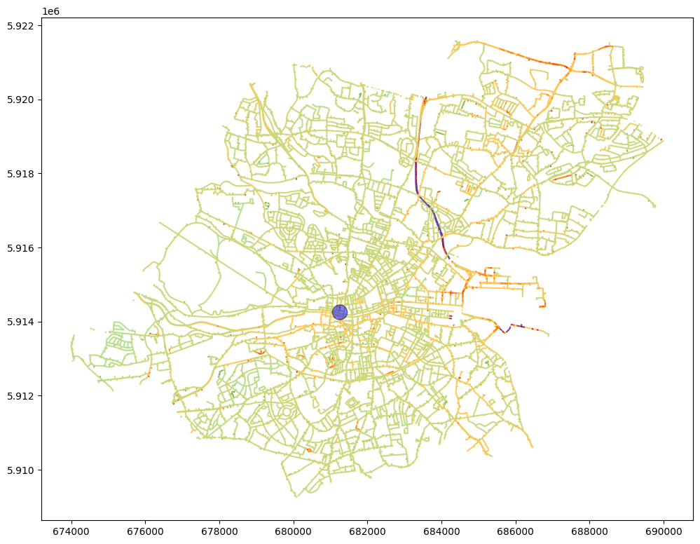
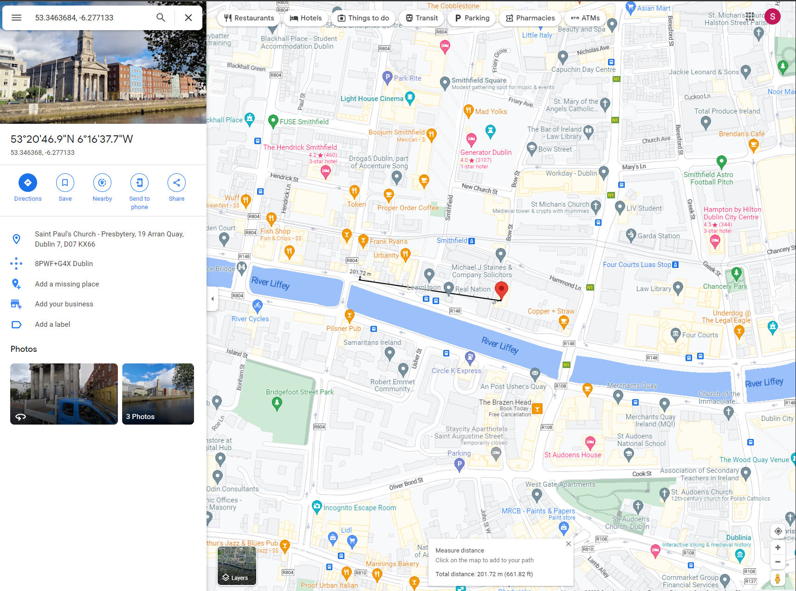

# Daft Air Quality (Backend)

## Overview

This repository hosts the source code for a Flask API that processes air quality data in Dublin City, collected by Google and Aclima. The API accepts latitude and longitude inputs and returns air quality information for the specified location. It is designed to serve as the backend for a Daft.ie plugin, enabling users to view air quality data around properties of interest.

 
 

## Road data metadeta

<table><thead><tr><th>Field Name</th><th>Description</th></tr></thead><tbody><tr><td>road_id</td><td>unique road segment ID</td></tr><tr><td>the_geom</td><td>road segment linestring</td></tr><tr><td>osm_id</td><td>OSM road ID</td></tr><tr><td>osm_code</td><td>OSM code</td></tr><tr><td>osm_fclass</td><td>OSM fclass / road-type</td></tr><tr><td>osm_name</td><td>OSM road name</td></tr><tr><td>osm_ref</td><td>OSM road ref</td></tr><tr><td>osm_oneway</td><td>OSM road metadata</td></tr><tr><td>osm_maxspeed</td><td>OSM road metadata</td></tr><tr><td>osm_layer</td><td>OSM road metadata</td></tr><tr><td>osm_bridge</td><td>OSM road metadata</td></tr><tr><td>osm_tunnel</td><td>OSM road metadata</td></tr><tr><td>NO2points</td><td>number of measurements on this road segment</td></tr><tr><td>NO2drives</td><td>number of drive passes on this road segment</td></tr><tr><td>NO2_ugm3</td><td>NO2 concentration (median of drive pass mean) in µg/m3</td></tr><tr><td>NOpoints</td><td>number of measurements on this road segment</td></tr><tr><td>NOdrives</td><td>number of drive passes on this road segment</td></tr><tr><td>NO_ugm3</td><td>NO concentration (median of drive pass mean) in µg/m3</td></tr><tr><td>CO2points</td><td>number of measurements on this road segment</td></tr><tr><td>CO2drives</td><td>number of drive passes on this road segment</td></tr><tr><td>CO2_mgm3</td><td>CO2 concentration (median of drive pass mean) in mg/m3</td></tr><tr><td>COpoints</td><td>number of measurements on this road segment</td></tr><tr><td>COdrives</td><td>number of drive passes on this road segment</td></tr><tr><td>CO_mgm3</td><td>CO concentration (median of drive pass mean) in mg/m3</td></tr><tr><td>O3points</td><td>number of measurements on this road segment</td></tr><tr><td>O3drives</td><td>number of drive passes on this road segment</td></tr><tr><td>O3_ugm3</td><td>O3 concentration (median of drive pass mean) in µg/m3</td></tr><tr><td>PM25points</td><td>number of measurements on this road segment</td></tr><tr><td>PM25drives</td><td>number of drive passes on this road segment</td></tr><tr><td>PM25_ugm3</td><td>PM2.5 concentration (median of drive pass mean) in µg/m3</td></tr></tbody></table>

 
 

## Data processing

 
 

### Assign colors to road segments based on pm2_5 averages and place a bufferone for house

 
 

 
 

### Isolate the intercepting roads

 
 

 
 

### Verify distances to ensure no major error

 
 

